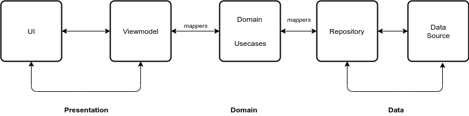
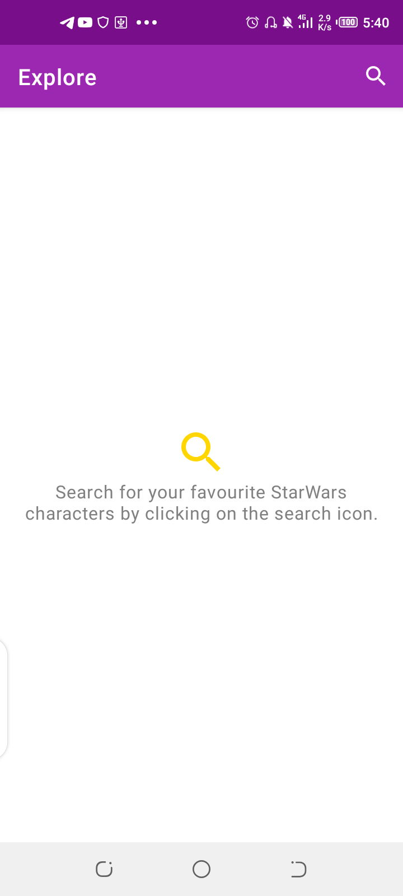
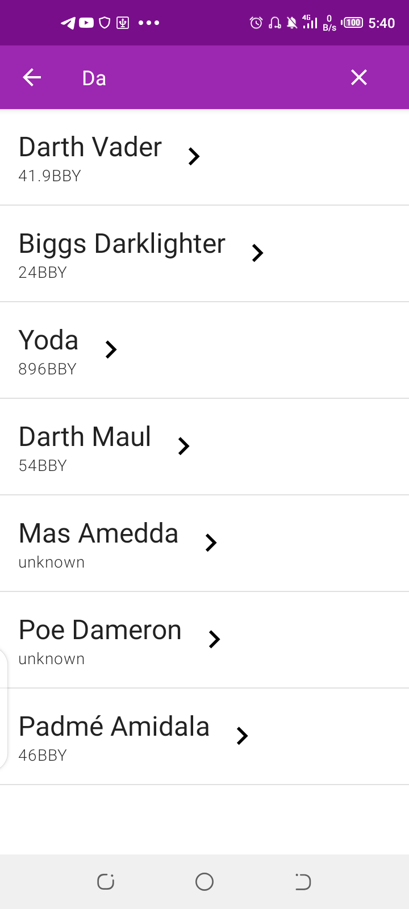
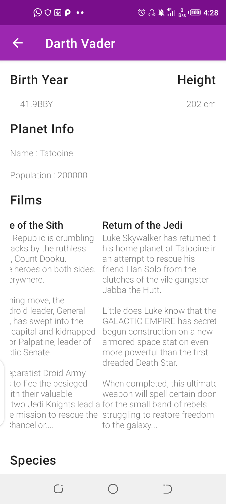

# The-Force

|[](https://travis-ci.com/Davidodari/The-Force-Clean-MVVM-ArchComponents-)|[](https://codecov.io/gh/Davidodari/The-Force-Clean-MVVM-ArchComponents-)|[](https://www.codacy.com?utm_source=github.com&amp;utm_medium=referral&amp;utm_content=Davidodari/The-Force-Clean-MVVM-ArchComponents-&amp;utm_campaign=Badge_Grade)|
|:---:|:---:|:---:|

An Android app consuming [a Star Wars API](https://swapi.co/documentation) to display Movie Characters
it has been built with Clean Architecture, Repository Pattern and MVVM
pattern as well as Architecture Components.

Min Api Level : 21 [Supports Over 87% Devices ](https://developer.android.com/about/dashboards)

Build System : [Gradle](https://gradle.org/)

## Prerequisite

Before running the project create a [firebase project](https://firebase.google.com/) 
and replace the **google-services.json** with yours in the `app` directory for a successful build and 
enable crashylitics.
```
package-name: com.k0d4black.theforce
```

## Table of Contents

- [Architecture](#architecture)
- [Testing](#testing)
- [Design](#design)
- [Libraries](#libraries)
- [Extras](#extras)
- [Screenshots](#screenshots)

## Architecture

The Application is split into a three layer architecture:
- Presentation
- Domain
- Data



This provides better abstractions between framework implementations 
and the underlying business logic.It requires a number of classes to get 
things running but the pros outweigh the cons in terms of building an app 
that should scale.

The 3 layered architectural approach is majorly guided by clean architecture which provides
a clear separation of concerns with its Abstraction Principle.

The `domain` and `data` layers are java module libraries as the business 
logic does not rely on the Android frameworks concrete implementations.
This will also help with build performance with a smaller Task Dependency Graph.

#### Presentation

The application presentation layer contains the Activity,Fragments and 
Viewmodels and handles Dependency Injection.

The UI layer `feature` package contains `character_detail` and `character_search` 
which contain an activity and corresponding viewmodel as well as other UI 
related classes.

The viewmodels are provided by the ViewModelFactory using Dagger2 it 
utilises the **Factory Pattern** by providing an annotation that maps the
respective viewmodel requested for instantiation with the `ViewModelProvider.Factory`

The ViewModel then receives data from the use case and updates the 
LiveData being watched by the activity,the Activity then makes updates 
to the UI as need be depending on the type of value received by the LiveData.
This results in the **Observer Pattern** and binding of list data with the
Recycler Views **Adapter Pattern**.

This pattern makes the Activities "dumb" by delegating data and logic 
operations to the Viewmodel,hence decoupling the UI layer and makes testing
components in isolation easier.

#### Domain

The domain layer contains domain model classes which represent the
data we will be handling across presentation and data layer.
The domain model data classes are used as a proxy communicating from the 
data layer to the presentation and vice versa this makes refactoring 
easy as their is separation of concerns allowing you to focus on a
particular layer in isolation.

The domain module also exposes a `ResultWrapper` class which utilises the 
**State Pattern**.This pattern makes it easier propagating changes to 
data state across layers and proves useful especially with coroutines 
which unlike RxJava do not contain an `onError()` method to emit errors.
Once a coroutine throws an exception the Result Wrapper will wrap the 
Excpetion and propagate necessary changes.

#### Data

The Data layer using the **Repository Pattern**  will be able to 
provide data to the defined use cases which in this case is searching
for characters and viewing details of selected characters.The use-cases
are based on the single responsibility rule as they serve only one particular 
purpose.

This provides a more decoupled system,as it is isolated from changes to the 
db by abstracting low level implementation details of data sources and
changes to the UI.

The repository classes delegate access of data to the data source of 
interest either local data source or a remote data source.

This layer also handles mapping of data entities to their domain 
representations which when eventually passed to the presentation layer the
domain will be mapped to the presentation model.

## Testing

Testing has been layered out differently based on the architectural layers.

1. Domain

In the Domain Layer the Domain Data Classes are tested since they act as 
the proxy to other layers a breaking change will propagate to other layers.

2. Data

Tests in the data inherit from a base test that provides a mock web server 
with the api interface to request paths the routing of paths to responses 
is handled by a custom mock web server dispatcher.

Json responses have also been provided in the test resource folder they 
are similar to the response that will be received from the api
The repository tests serve as integration tests between the data sources
and mappers to the domain models.
Currently the data source tests serve as unit tests verifying the appropriate
responses are received from remote source.

We mock the repositories and verify the expected behavior once a use case
has been called to action.

The Domain Layer Models are also tested to verify instance was created 
successfully with expected parameters and will also be of help in the event
the model structure needs to change when mapping data.

Utilities and Extension functions have also been fully tested for edge cases.

3. Presentation

The Presentation layer contains robolectric jvm tests on for menu items 
and instrumentation tests checking on system behaviour as per user expectation.

The UI tests display data served from a mock web server running from the
devices localhost,this removes flakiness compared to relying on actual 
data from the real server aspects such as internet connection or 
network service might bring up issues.

The tests are have been done per screen which is representative of the
features available on the app.

## Design

 With the current min api level set to 21 we have access to material
 libraries and can build awesome UIs.
 
 **Search Screen**
 
 The Search screen contains a default text view that will hint user on 
 how to search and on search they will be presented with a list of characters.
 The characters on the search result only contain a name ,birth year and url 
 that will be used to load more content if need be,this saves on loading time 
 and results in a faster search experience.
 
 The list results are bound by a recycler view,which recycles views and 
 provides a tonne of flexibility including things such as custom item layout,
 item decoration,custom headers and much more as compared to its List View 
 Counterpart.
 
 Each List item contains a button when on clicked navigates to 
 `CharacterDetailsActivity` screen with an Intent Extra of character id.
 
 **Details Screen**
 
 The details Screen displays character information after viewmodel receives 
 data from the usecase.The data is bound through Data binding ,which 
 proves useful to binding model data removing need for boilerplate
 findViewById.
 
 The Character Details are displayed by satisfying constraints to various 
 views using the constraint layout which flattens our view hierarchy and 
 avoids nesting of multiple layouts for displaying complex objects.
 
 The views displaying character data are logically  grouped by 
 constraint layout Group widget making it simpler to enable and disable 
 a large set of views.
 
## Libraries

Libraries used in the whole application are:

- [Jetpack](https://developer.android.com/jetpack)🚀
  - [Viewmodel](https://developer.android.com/topic/libraries/architecture/viewmodel) - Manage UI related data in a lifecycle conscious way 
  and act as a channel between use cases and ui
  - [Data Binding](https://developer.android.com/topic/libraries/data-binding) - support library that allows binding of UI components in  layouts to data sources,binds character details and search results to UI
- [Retrofit](https://square.github.io/retrofit/) - type safe http client 
and supports coroutines out of the box.  
- [Moshi](https://github.com/square/moshi) - JSON Parser,used to parse 
requests on the data layer for Entities and understands Kotlin non-nullable 
and default parameters
- [okhttp-logging-interceptor](https://github.com/square/okhttp/blob/master/okhttp-logging-interceptor/README.md) - logs HTTP request and response data.
- [Mockito](https://site.mockito.org/) - Mocking framework used to provide mocks of my classes in unit tests.
- [kotlinx.coroutines](https://github.com/Kotlin/kotlinx.coroutines) - Library Support for coroutines,provides `runBlocking` coroutine builder used in tests
- [Truth](https://truth.dev/) - Assertions Library,provides readability as far as assertions are concerned
- [MockWebServer](https://github.com/square/okhttp/tree/master/mockwebserver) - web server for testing HTTP clients ,verify requests and responses on the star wars api with the retrofit client.
- [Leak Canary](https://square.github.io/leakcanary/) - Leak Detection Library
- [Material Design](https://material.io/develop/android/docs/getting-started/) - build awesome beautiful UIs.🔥🔥
- [Firebase](https://firebase.google.com/) - Backend As A Service for faster mobile development.
  - [Crashylitics](https://firebase.google.com/docs/crashlytics) - Provide Realtime crash reports from users end.
- [Dagger2](https://github.com/google/dagger) - Dependency Injection lib built with scaling in mind and has large community support.
- [Robolectric](http://robolectric.org/) - Unit test on android framework.
- [Espresso](https://developer.android.com/training/testing/espresso) - Test framework to write UI Tests

## Extras

#### Gradle Dependencies

Centralized versioning of gradle dependencies in a global file,
```dependencies.gradle```, visible to all available modules.This helps 
maintain dependency versioning for different modules as well as improve
dependency organisation and readability by providing a clear separation
of which dependencies go where.

#### CI-Pipeline

[Travis CI](https://travis-ci.com/) is used for development pipeline to
automatically build and test the project every time you push updates to 
version control.

#### Code Analysis

With static code analysis you can enforce a consistent style guide on 
the project.This is possible by defining constraints with Detekt.

This Project is integrated with [Codacy](https://www.codacy.com/) that 
makes use of Detekt for static code analysis on Kotlin files.You can
either configure rules from their dashboard or enforce a Detekt 
configuration locally and port it to codacy.

The rules can be configured to be checked for each pull request,commit 
or merge made.

#### Resource Values

**Fonts**

The app makes use of downloadable fonts which reduces APK size compared to
having the font files within the app.

**Colors**

The App colors follow the material design guidelines to theming.

**Dimension & String Values**

String values are stored in the strings value file this will make it 
easier for app localization and internationalization as well as string
templating currently utilised by data binding.

Dimensions have also been stored in a dimensions value file making it 
easy to reuse dimension values across the app.

**Themes & Styles**

Theming is guided by the material design specifications with a ```DayNight```
theme which can later be used to provide Night variant for the app and 
enhance user experience.

#### Converting centimeters to inches

There is a utility,`convertToInches` method which takes in a centimeter 
value from the domain model and on mapping to the presentation layer 
model it takes in both centimeters and assigns a converted value to 
height in inches property.

## Screenshots

|  |||
|:----:|:----:|:----:|
| 🔍Search Screen - Default|Search Screen - Results|Character Details|

## TODO

- Persistence/Caching Strategy
- Search Query Suggestions
- Animations
- Screen Adaptability - Currently locked to portrait mode
- Use Idling Resource for UI tests.
- User Friendly Error Messages.

## License

 ```
   Copyright 2019 David Odari
   
   Licensed under the Apache License, Version 2.0 (the "License");
   you may not use this file except in compliance with the License.
   You may obtain a copy of the License at

       http://www.apache.org/licenses/LICENSE-2.0

   Unless required by applicable law or agreed to in writing, software
   distributed under the License is distributed on an "AS IS" BASIS,
   WITHOUT WARRANTIES OR CONDITIONS OF ANY KIND, either express or implied.
   See the License for the specific language governing permissions and
   limitations under the License.
 ```


