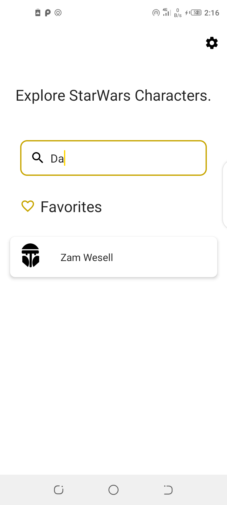
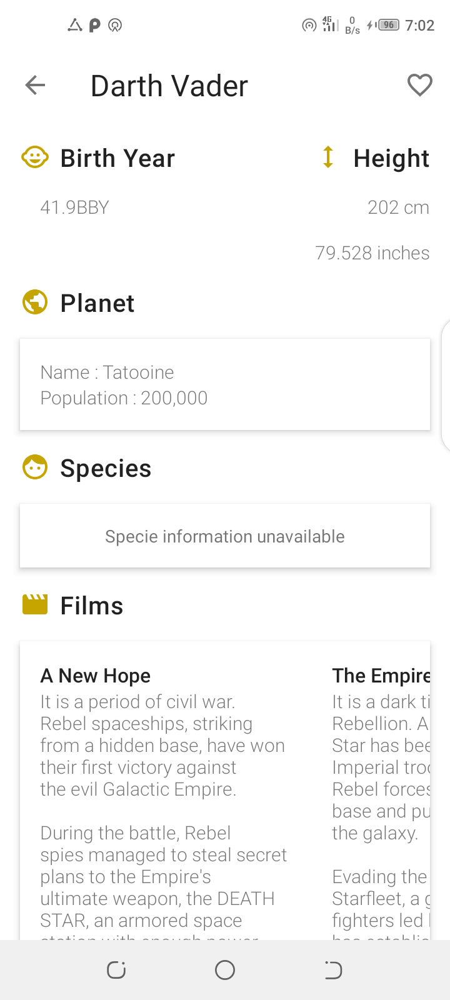
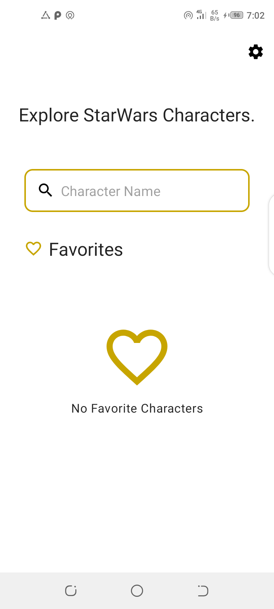
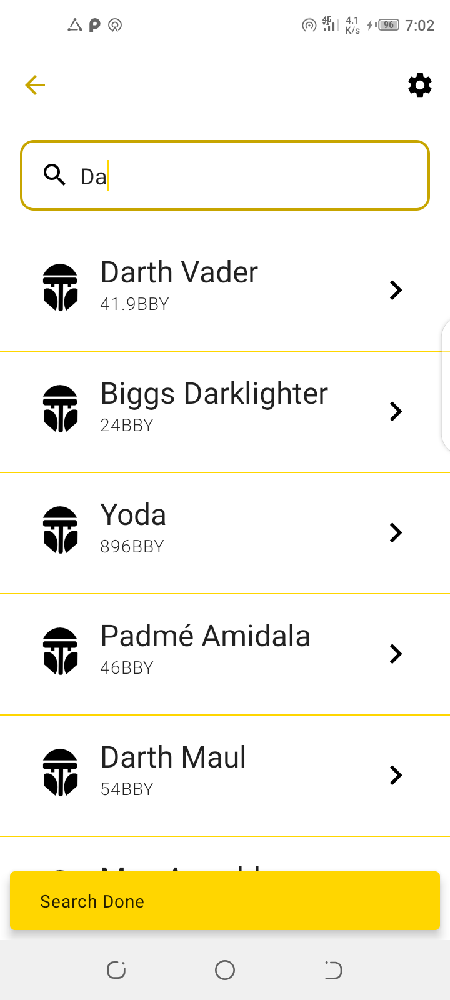
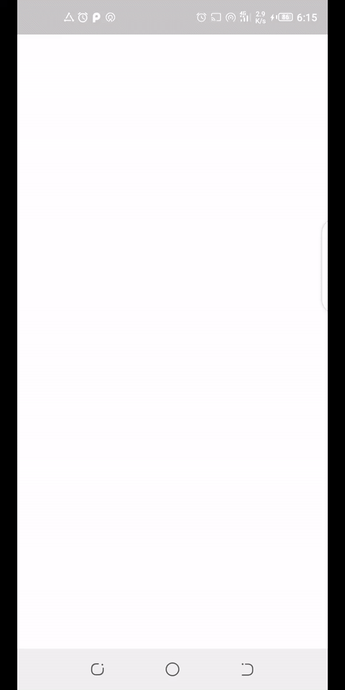

<p align="center">

</p>
<p align="center">
&nbsp;
<a href="https://codecov.io/gh/odaridavid/Clean-MVVM-ArchComponents">
  
</a>&nbsp;
<a href="https://www.codacy.com/manual/odaridavid/Clean-MVVM-ArchComponents?utm_source=github.com&amp;utm_medium=referral&amp;utm_content=odaridavid/Clean-MVVM-ArchComponents&amp;utm_campaign=Badge_Grade"></a>
</p>

# The-Force

An Android app consuming [a Star Wars API](https://swapi.dev/) to display Movie Characters
it has been built with clean architecture principles, Repository Pattern and MVVM
pattern as well as Architecture Components.

Min Api Level : 21 [Supports Over 87% Devices ](https://developer.android.com/about/dashboards)

Build System : [Gradle](https://gradle.org/)

## Table of Contents

- [Prerequisite](#prerequisite)
- [Architecture](#architecture)
- [Testing](#testing)
- [Libraries](#libraries)
- [Contributors](#contributors)
- [Related Posts](#related-posts)
- [Demo](#demo)

## Prerequisite

To run the release build successfully in travis you will need to replace the default values in 
```keystore.properties.sample```file with your own in a ```keystore.properties``` file.

Next archive your keystore file and the properties file with the following command
```shell script
 tar cvf secrets.tar keystore.properties theforce.jks
```

Next encrypt the archive and add config to travis with the following command
```shell script
travis encrypt-file --pro secrets.tar --add
```

Verify that in your travis.yml in the ```before_install``` it looks something like
```yaml
before_install:
  - openssl aes-256-cbc -K $encrypted_5880cf525281_key -iv $encrypted_5880cf525281_iv -in secrets.tar.enc -out secrets.tar -d
  - tar xvf secrets.tar
```

Make sure to add only the `*.enc` file to git,leave out the keystore.properties and `*.jks` file.
Add the following to the root `.gitignore` just to be sure
```gitignore
*.jks
*.tar
keystore.properties
```

If you encounter any error check [this site](https://docs.travis-ci.com/user/encrypting-files/) out.

To setup the Travis CLI tools see [this](https://github.com/travis-ci/travis.rb#installation) 

## Architecture

The Application is split into a three layer architecture:
- Presentation
- Domain
- Data


This provides better abstractions between framework implementations 
and the underlying business logic.It requires a number of classes to get 
things running but the pros outweigh the cons in terms of building an app 
that should scale.

The 3 layered architectural approach is majorly guided by clean architecture which provides
a clear separation of concerns with its Abstraction Principle.

#### Presentation

```app``` contains the UI files and handles binding of DI components from other modules.
Binding of data is facilitated by jetpacks data binding by serving data from the viewmodel
to the UI.The data being received is part of a viewstate class that has properties contained in the
relevant state.

#### Domain

The ```domain``` module contains domain model classes which represent the
data we will be handling across presentation and data layer.

Use cases are also provided in the domain layer and orchestrate the flow 
of data from the data layer onto the presentation layer and a split into
modular pieces serving one particular purpose.

The UseCases use a ```BaseUseCase``` interface that defines the parameters its taking in and 
output this helps in creating fakes using in testing.

#### Data

- ```data-remote```

Handles data interacting with the network and is later serverd up to the presentation layer through 
domain object

- ```data-local```

Handles persistence of object with Room ORM from.This module is responsible for handling all local related
logic and serves up data to and from the presentation layer through domain objects.

With this separation we can easily swap in new or replace the database being used without causeing
major ripples across the codebase.

## Testing

Each module has its own tests except for the ```domain``` module which is catered for since its
part of the behavior under test.

All server responses in the tests are served by mock web server by appending relative urls to
the localhost and the connected port as the base url.

In the ``data-remote`` module the responses are mocked using the mockwebserver and verified that they
are what we expect.

In the ```data-local``` module an in  memory database is being used to run the tests,this makes it a 
little faster compared to an actual db.

In the ```app``` module there are unit tests for the viewmodels and util classes 
and connected tests for the UI Screens.

The test instrumentation app uses modules that have been swaped with fakes for
the network module so as to run requests on localhost with mockwebserver,this removes flakiness 
compared to relying on actual  data from the real server aspects such as internet connection or
network service might bring up issues and an in memory database for local data that also allows 
main thread queries since tests should also be fast and we are just asserting stuff works.

View models testing on live data were guided by this [article](https://proandroiddev.com/how-to-easily-test-a-viewmodel-with-livedata-and-coroutines-230c74416047)
 
## Libraries

Libraries used in the whole application are:

- [Jetpack](https://developer.android.com/jetpack)🚀
  - [Viewmodel](https://developer.android.com/topic/libraries/architecture/viewmodel) - Manage UI related data in a lifecycle conscious way 
  and act as a channel between use cases and ui
  - [Data Binding](https://developer.android.com/topic/libraries/data-binding) - support library that allows binding of UI components in  layouts to data sources,binds character details and search results to UI
  - [Room](https://developer.android.com/training/data-storage/room) - Provides abstraction layer over SQLite
- [Retrofit](https://square.github.io/retrofit/) - type safe http client 
and supports coroutines out of the box.  
- [Moshi](https://github.com/square/moshi) - JSON Parser,used to parse 
requests on the data layer for Entities and understands Kotlin non-nullable 
and default parameters
- [okhttp-logging-interceptor](https://github.com/square/okhttp/blob/master/okhttp-logging-interceptor/README.md) - logs HTTP request and response data.
- [kotlinx.coroutines](https://github.com/Kotlin/kotlinx.coroutines) - Library Support for coroutines,provides `runBlocking` coroutine builder used in tests
- [Truth](https://truth.dev/) - Assertions Library,provides readability as far as assertions are concerned
- [MockWebServer](https://github.com/square/okhttp/tree/master/mockwebserver) - web server for testing HTTP clients ,verify requests and responses on the star wars api with the retrofit client.
- [Leak Canary](https://square.github.io/leakcanary/) - Leak Detection Library
- [Material Design](https://material.io/develop/android/docs/getting-started/) - build awesome beautiful UIs.🔥🔥
- [Firebase](https://firebase.google.com/) - Backend As A Service for faster mobile development.
  - [Crashylitics](https://firebase.google.com/docs/crashlytics) - Provide Realtime crash reports from users end.
- [Koin](https://github.com/InsertKoinIO/koin) - A pragmatic lightweight dependency injection framework for Kotlin
- [Robolectric](http://robolectric.org/) - Unit test on android framework.
- [Espresso](https://developer.android.com/training/testing/espresso) - Test framework to write UI Tests
- [recyclerview-animators](https://github.com/wasabeef/recyclerview-animators) - Recycler View Animations
- [AboutLibraries](https://github.com/mikepenz/AboutLibraries) -provide info on used open source libraries.
- [Stetho](https://github.com/facebook/stetho) - debug bridge
- [Kiel](https://github.com/ibrahimyilmaz/kiel) - Kiel RecyclerView Adapter Builders

## Contributors

- Thanks to [Zafer Celaloglu](https://github.com/zfrc) for the Dagger to Koin Refactor and additional test cases.

Feel free to contribute in any way to the project from typos in docs to code review are all welcome.

## Demo

The codebase in most cases will be ahead of whats on the store.

|||||
|:----:|:----:|:----:|:----:|

||
|:----:|

<a href='https://play.google.com/store/apps/details?id=com.k0d4black.theforce&pcampaignid=pcampaignidMKT-Other-global-all-co-prtnr-py-PartBadge-Mar2515-1'></a>

Google Play and the Google Play logo are trademarks of Google LLC.

## Copyright Notice

Star Wars and all associated names are copyright Lucasfilm ltd.

## Related Posts

[Handling Dynamic Urls](https://davidodari.hashnode.dev/retrofit-handling-dynamic-urls-ck9zygtw700x0ans1tm5spma4)

## License

 ```
   Copyright 2019 David Odari
   
   Licensed under the Apache License, Version 2.0 (the "License");
   you may not use this file except in compliance with the License.
   You may obtain a copy of the License at

       http://www.apache.org/licenses/LICENSE-2.0

   Unless required by applicable law or agreed to in writing, software
   distributed under the License is distributed on an "AS IS" BASIS,
   WITHOUT WARRANTIES OR CONDITIONS OF ANY KIND, either express or implied.
   See the License for the specific language governing permissions and
   limitations under the License.
 ```
