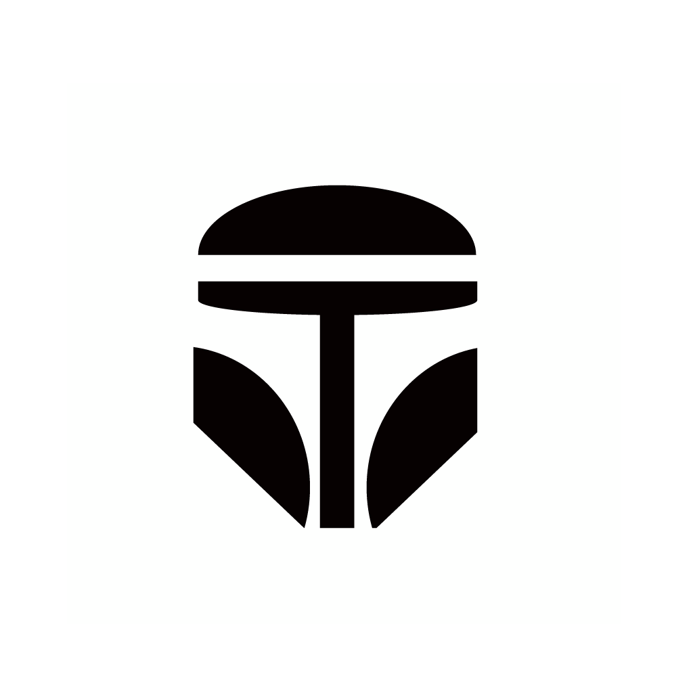
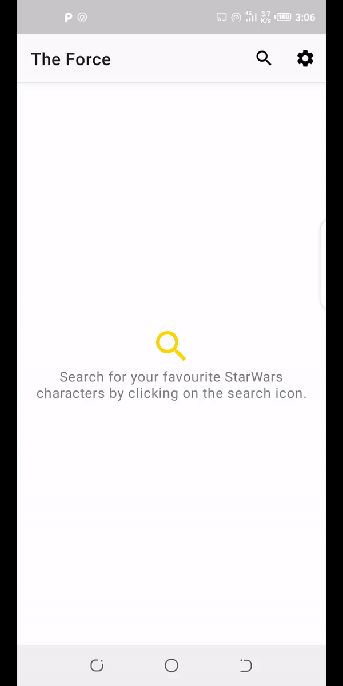

<p align="center">

</p>
<p align="center">
&nbsp;
<a href="https://codecov.io/gh/Davidodari/The-Force-Clean-MVVM-ArchComponents-">
  
</a>&nbsp;
<a href="https://codebeat.co/projects/github-com-odaridavid-clean-mvvm-archcomponents-develop"></a>
</p>

# The-Force

An Android app consuming [a Star Wars API](https://swapi.dev/) to display Movie Characters
it has been built with clean architecture principles, Repository Pattern and MVVM
pattern as well as Architecture Components.

Min Api Level : 21 [Supports Over 87% Devices ](https://developer.android.com/about/dashboards)

Build System : [Gradle](https://gradle.org/)

## Prerequisite

Before running the project create a [firebase project](https://firebase.google.com/) 
and replace the **google-services.json** with yours in the `app` directory for a successful build and 
enable crashylitics.
```
package-name: com.k0d4black.theforce
```

To run the release build you will need to replace the default values in ```keystore.properties```
file with your own.

## Table of Contents

- [Architecture](#architecture)
- [Testing](#testing)
- [Libraries](#libraries)
- [Contributors](#contributors)
- [Related Posts](#related-posts)
- [Demo](#demo)

## Architecture

The Application is split into a three layer architecture:
- Presentation
- Domain
- Data


This provides better abstractions between framework implementations 
and the underlying business logic.It requires a number of classes to get 
things running but the pros outweigh the cons in terms of building an app 
that should scale.

The 3 layered architectural approach is majorly guided by clean architecture which provides
a clear separation of concerns with its Abstraction Principle.

The `domain` and `data` layers are java module libraries as the business 
logic does not rely on the Android frameworks concrete implementations.

#### Presentation

The application presentation layer contains the Activity,Fragments and 
Viewmodels and handles Dependency Injection.

The UI layer `feature` package contains `character_detail` and 
`character_search` which contain an activity and corresponding 
viewmodel as well as other UI related classes.

The viewmodels are provided by the Koin that uses Kotlin's DSLs
to lazily resolve dependency graph at runtime

The ViewModel then receives data from the use case and updates the 
LiveData being observed by the activity,the Activity then makes updates 
to the UI as need be depending on the current view state.

The UI utilises a **State pattern** by representing expected view states using sealed classes.
This aids with delegating logic operations  to the Viewmodel and makes testing in isolation
easier.

#### Domain

The domain layer contains domain model classes which represent the
data we will be handling across presentation and data layer.

Use cases are also provided in the domain layer and orchestrate the flow 
of data from the data layer onto the presentation layer and a split into
modular pieces serving one particular purpose.

The UseCases use a ```BaseUseCase``` interface that defines the parameters its taking in and output
this helps in creating fakes using in testing.

#### Data

The Data layer using the **Repository Pattern**  will be able to 
provide data to the defined use cases which in this case is searching
for characters and viewing details of selected characters.The use-cases
are based on the single responsibility rule.

This provides a more decoupled system,as it is isolated from changes to the 
db by abstracting low level implementation details of data sources and
changes to the UI.

The repository classes delegate access of data to the data source of 
interest either local data source or a remote data source.

This layer also handles mapping of data entities to their domain 
representations which when eventually passed to the presentation layer the
domain will be mapped to the presentation model.

## Testing

Testing has been done based on the architectural layers.

1.Domain

Contains tests that encompass domain models and uses mockito to verify 
use case behavior.

2.Data

Tests in the data inherit from a base test that provides a mock web server 
with the api interface to request paths the routing of paths to responses 
is handled by a custom mock web server dispatcher.

Json responses have also been provided in the test resource folder they 
are similar to the response that will be received from the api
The repository tests serve as integration tests between the data sources
and mappers to the domain models.
Currently the data source tests serve as unit tests verifying the appropriate
responses are received from remote source.

3.Presentation

The Presentation layer contains robolectric jvm tests on for menu items 
and instrumentation tests checking on system behaviour as per user
expectation.

The UI tests display data served from a mock web server running from the
devices localhost,this removes flakiness compared to relying on actual 
data from the real server aspects such as internet connection or 
network service might bring up issues.

View models testing on live data were guided by this [article](https://proandroiddev.com/how-to-easily-test-a-viewmodel-with-livedata-and-coroutines-230c74416047)
 
## Libraries

Libraries used in the whole application are:

- [Jetpack](https://developer.android.com/jetpack)🚀
  - [Viewmodel](https://developer.android.com/topic/libraries/architecture/viewmodel) - Manage UI related data in a lifecycle conscious way 
  and act as a channel between use cases and ui
  - [Data Binding](https://developer.android.com/topic/libraries/data-binding) - support library that allows binding of UI components in  layouts to data sources,binds character details and search results to UI
- [Retrofit](https://square.github.io/retrofit/) - type safe http client 
and supports coroutines out of the box.  
- [Moshi](https://github.com/square/moshi) - JSON Parser,used to parse 
requests on the data layer for Entities and understands Kotlin non-nullable 
and default parameters
- [okhttp-logging-interceptor](https://github.com/square/okhttp/blob/master/okhttp-logging-interceptor/README.md) - logs HTTP request and response data.
- [Mockito](https://site.mockito.org/) - Mocking framework used to provide mocks to verify behaviour in domain usecases tests.
- [kotlinx.coroutines](https://github.com/Kotlin/kotlinx.coroutines) - Library Support for coroutines,provides `runBlocking` coroutine builder used in tests
- [Truth](https://truth.dev/) - Assertions Library,provides readability as far as assertions are concerned
- [MockWebServer](https://github.com/square/okhttp/tree/master/mockwebserver) - web server for testing HTTP clients ,verify requests and responses on the star wars api with the retrofit client.
- [Leak Canary](https://square.github.io/leakcanary/) - Leak Detection Library
- [Material Design](https://material.io/develop/android/docs/getting-started/) - build awesome beautiful UIs.🔥🔥
- [Firebase](https://firebase.google.com/) - Backend As A Service for faster mobile development.
  - [Crashylitics](https://firebase.google.com/docs/crashlytics) - Provide Realtime crash reports from users end.
- [Koin](https://github.com/InsertKoinIO/koin) - A pragmatic lightweight dependency injection framework for Kotlin
- [Robolectric](http://robolectric.org/) - Unit test on android framework.
- [Espresso](https://developer.android.com/training/testing/espresso) - Test framework to write UI Tests
- [recyclerview-animators](https://github.com/wasabeef/recyclerview-animators) - Recycler View Animations
- [AboutLibraries](https://github.com/mikepenz/AboutLibraries) -provide info on used open source libraries.

## Contributors

- Thanks to [Zafer Celaloglu](https://github.com/zfrc) for the Dagger to Koin Refactor and additional test cases.

Feel free to contribute in any way to the project.

## Demo




<a href='https://play.google.com/store/apps/details?id=com.k0d4black.theforce&pcampaignid=pcampaignidMKT-Other-global-all-co-prtnr-py-PartBadge-Mar2515-1'></a>

Google Play and the Google Play logo are trademarks of Google LLC.

## Copyright Notice

Star Wars and all associated names are copyright Lucasfilm ltd.

## Related Posts

[Handling Dynamic Urls](https://davidodari.hashnode.dev/retrofit-handling-dynamic-urls-ck9zygtw700x0ans1tm5spma4)

## License

 ```
   Copyright 2019 David Odari
   
   Licensed under the Apache License, Version 2.0 (the "License");
   you may not use this file except in compliance with the License.
   You may obtain a copy of the License at

       http://www.apache.org/licenses/LICENSE-2.0

   Unless required by applicable law or agreed to in writing, software
   distributed under the License is distributed on an "AS IS" BASIS,
   WITHOUT WARRANTIES OR CONDITIONS OF ANY KIND, either express or implied.
   See the License for the specific language governing permissions and
   limitations under the License.
 ```


