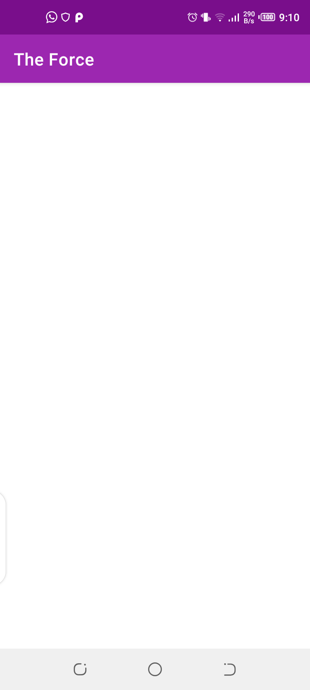

# The-Force

|[](https://travis-ci.com/Davidodari/The-Force-Clean-MVVM-ArchComponents-)|[](https://codecov.io/gh/Davidodari/The-Force-Clean-MVVM-ArchComponents-)|[](https://www.codacy.com?utm_source=github.com&amp;utm_medium=referral&amp;utm_content=Davidodari/The-Force-Clean-MVVM-ArchComponents-&amp;utm_campaign=Badge_Grade)|
|:---:|:---:|:---:|

An Android app consuming [a Star Wars API](https://swapi.co/documentation) to display Movie Characters
it has been built with Clean Architecture, Repository Pattern and MVVM
pattern as well as Architecture Components.

Min Api Level : 21 [Supports Over 87% Devices ](https://developer.android.com/about/dashboards)
Build System : Gradle

## Prerequisite

Before running the project create a [firebase project](https://firebase.google.com/) 
and replace the **google-services.json** with yours in the `app` directory for a successful build and 
enable crashylitics.
```
package-name: com.k0d4black.theforce
```

## Table of Contents

- [Architecture](#architecture)
- [Persistence](#persistence)
- [Testing](#testing)
- [Design](#design)
- [Libraries](#libraries)
- [Extras](#extras)
- [Screenshots](#screenshots)

## Architecture

The Application is split into a three layer architecture:
- Presentation
- Domain
- Data


This provides better abstractions between concrete framework implementations 
and the underlying business logic.It requires a number of classes to get 
things running but the pros outweigh the cons in terms of building an app 
that should scale.

The 3 layered architectural approach is majorly guided by clean architecture which provides
a clear separation of concerns with its Abstraction Principle.

The `domain` and `data` layers are java module libraries as the business 
logic does not rely on the Android frameworks concrete implementations.
This will also help with build performance with a smaller Task Dependency Graph.

#### Presentation

The application presentation layer contains the Activity,Fragments and 
Viewmodels.

The UI layer packages `detail` and `search` contain a fragment and 
corresponding viewmodel as well as other UI related classes.

The `Main Activity` acts as a [NavHost](https://developer.android.com/guide/navigation/navigation-getting-started) 
to the fragments in the UI layer.This utilises the navigation architecture 
components and has a Single Activity Architecture,this serves as the apps
entry point and navigation across the fragments is handled by the
[navigation component](https://developer.android.com/guide/navigation)

The fragment viewmodels are mapped to the corresponding use cases.
This makes it easier to test fragments in isolation, simple provision of 
transition animations to destinations and also removes the need of
working with fragment transactions as its been abstracted with the 
NavController ,saving dev time.

#### Domain

Contains Business Logic Abstractions which consitutes models 
representative of searched character and character details as well as 
repository contracts to be implemented in data layer and use case 
implementations.

The contract interfaces will come in handy during faking of implementations
when testing they also follow interface segregation as well as Liskov 
substitution as far as SOLID principles are concerned. 


#### Data

The Data layer satisfies the repository contracts and using the repository
pattern we will be able to provide data to the defined use cases which 
in this case is searching for characters and viewing details of selected 
characters.The use cases are inline with the single responsibility rule.

This provides a more decoupled system,as it is isolated from changes to the 
db by abstracting low level implementation details of data sources and
changes to the UI.

The repository classes delegate access of data to the data source of 
interest either local data source or a remote data source.

This layer also handles mapping of data entities to their domain 
representations.

## Persistence

 ```TODO``` 

## Testing

Testing has been layered out differently based on the architectural layers

1. Domain

In the Domain Layer we test the Use Cases are executed and collaborators 
behave as expected,the repositories in this case.

We mock the repositories and verify the expected behavior once a use case
has been called to action.

The Domain Layer Models are also tested to verify instance was created 
successfully with expected parameters and will also be of help in the event
the model structure needs to change when mapping data.

Utilities and Extension functions have also been fully tested for edge cases.


2. Data

Tests in the data inherit from a base test that provides a mock web server 
with the api interface to request paths the routing of paths to responses is handled
by a custom mock web server dispatcher.
Json responses have also been provided in the test resource folder they 
are similar to the response that will be received from the api
The repository tests serve as integration tests between the data sources
and mappers to the domain models.
Currently the data source tests serve as unit tests verifying the appropriate
responses are received from remote source.

3. Presentation


## Design

 With the current min api level set to 21 we have access to material libraries and can build awesome UIs.
 

## Libraries

Libraries used in the whole application are:

- [Jetpack](https://developer.android.com/jetpack)🚀
  - [Navigation](https://developer.android.com/guide/navigation/) - 
  Caters for in app navigation with the NavController.
  - [Viewmodel](https://developer.android.com/topic/libraries/architecture/viewmodel) - Manage UI related data in a lifecycle conscious way 
  and act as a channel between use cases and ui
  - [Data Binding](https://developer.android.com/topic/libraries/data-binding) - support library that allows binding of UI components in your layouts to data sources,binds character details to UI
- [Retrofit](https://square.github.io/retrofit/) - type safe http client 
and supports coroutines out of the box.  
- [Moshi](https://github.com/square/moshi) - JSON Parser,used to parse 
requests on the data layer for Entities and understands Kotlin non-nullable 
and default parameters
- [okhttp-logging-interceptor](https://github.com/square/okhttp/blob/master/okhttp-logging-interceptor/README.md) - logs HTTP request and response data.
- [Mockito](https://site.mockito.org/) - Mocking framework used to provide mocks of my classes in unit tests.
- [kotlinx.coroutines](https://github.com/Kotlin/kotlinx.coroutines) - Library Support for coroutines,provides `runBlocking` coroutine builder used in tests
- [Truth](https://truth.dev/) - Assertions Library,provides readability as far as assertions are concerned
- [MockWebServer](https://github.com/square/okhttp/tree/master/mockwebserver) - web server for testing HTTP clients ,verify requests and responses on the star wars api with the retrofit client.
- [Leak Canary](https://square.github.io/leakcanary/) - Leak Detection Library
- [Material Design](https://material.io/develop/android/docs/getting-started/) - build awesome beautiful UIs.🔥🔥
- [Firebase](https://firebase.google.com/) - Backend As A Service for faster mobile development.
  - [Crashylitics](https://firebase.google.com/docs/crashlytics) - Provide Realtime crash reports from users end.

## Extras

#### Gradle Dependencies

Centralized versioning of gradle dependencies in a global file,
```dependencies.gradle```, visible to all available modules.This helps 
maintain dependency versioning for different modules as well as improve
dependency organisation and readability by providing a clear separation
of which dependencies go where.

#### Error Handling With Coroutines

When an exception is thrown a null value is returned from the try catch block 
in the suspended function.

#### CI-Pipeline

[Travis CI](https://travis-ci.com/) is used for development pipeline to
automatically build and test the project every time you push updates to 
version control.

#### Code Analysis

With static code analysis you can enforce a consistent style guide on 
the project.This is possible by defining constraints with Detekt.

This Project is integrated with [Codacy](https://www.codacy.com/) that 
makes use of Detekt for static code analysis on Kotlin files.You can
either configure rules from their dashboard or enforce a Detekt 
configuration locally and port it to codacy.

The rules can be configured to be checked for each pull request,commit 
or merge made.

## Screenshots

|  |
|:----:|
| 🔍Search Screen |


## License

 ```
   Copyright 2019 David Odari
   
   Licensed under the Apache License, Version 2.0 (the "License");
   you may not use this file except in compliance with the License.
   You may obtain a copy of the License at

       http://www.apache.org/licenses/LICENSE-2.0

   Unless required by applicable law or agreed to in writing, software
   distributed under the License is distributed on an "AS IS" BASIS,
   WITHOUT WARRANTIES OR CONDITIONS OF ANY KIND, either express or implied.
   See the License for the specific language governing permissions and
   limitations under the License.
 ```


